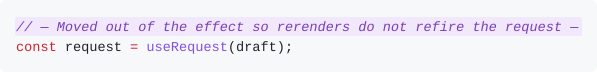

# AI Comments

AI agents like to explain their changes in comments. Those explanations help whoever reviews the diff, but they clutter the codebase once it's merged.

AI Comments gives them their own syntax, highlights them in your IDE, and strips them when you commit, so they never reach git history.

## How it works

**1. The agent explains a change** with a comment wrapped in em-dashes. Your IDE highlights it:

<picture>
  <source media="(prefers-color-scheme: dark)" srcset="docs/example-dark.svg">
  
</picture>

**2. You review the diff** with the explanation right next to the change.

**3. You commit.** The AI comment is removed from the commit and from your working tree:

```ts
const request = useRequest(draft);
```

Regular comments are untouched, so they stay what they should be: constraints the code cannot express.

## Install

**JetBrains IDEs** (WebStorm, IntelliJ IDEA, Android Studio, … 2025.2+): Settings | Plugins | Marketplace, search for **AI Comments**.

**VS Code** (1.90+, and forks like Cursor): install **AI Comments** (`war-in.ai-comments`) from the Extensions view. Forks get it from Open VSX.

**Claude Code:**

```
/plugin marketplace add war-in/ai-comments
/plugin install ai-comments@war-in
```

This teaches Claude the convention, strips AI comments before every `git commit` Claude runs, and warns Claude when it leaves one unclosed. If you had a copy of the rule in `~/.claude/rules/` or a `CLAUDE.md`, remove it: the plugin adds it for you.

No per-repository setup is needed.

## Syntax

The comment body starts with `— ` and ends with ` —` (U+2014 em-dash, with a space inside each dash):

```ts
// — One line —

const total = sum(items); // — Trailing —

/* — A block that spans
   several lines — */

{/* — In JSX; the braces are stripped too — */}
```

Other languages work the same way: `# — … —`, `-- — … —`, <code>&lt;!-- — … — --&gt;</code>.

- An AI comment that never closes is **not** stripped. The IDE warns you and offers a quick fix.
- `/** … */` doc comments are never AI comments.

## When it strips

| You commit from | Stripped? |
|---|---|
| JetBrains commit dialog | Yes. Toggle: **Strip AI comments** in the commit options |
| VS Code (Commit button, `Cmd/Ctrl+Enter`, …) | Yes. Toggle: `aiComments.stripOnCommit` |
| Claude Code running `git commit` | Yes |
| A terminal | No. Run `ai-comments strip <files>` first, or commit from the IDE |

## Limitations

- Claude Code hooks don't run on Windows or Intel macOS yet.

## Contributing

See [CONTRIBUTING.md](CONTRIBUTING.md).
